# 🧠 IA Embarquée  
**Projet collaboratif de déploiement de modèle d’intelligence artificielle sur STM32**

---

## 👥 Collaborateurs

- Hugo CELARIE  
- Pablo COLIN  

---

## 📁 Arborescence du Dépôt

Ce dépôt GitHub est structuré comme suit :

- `COLAB/`  
  - Notebook Jupyter `TP_IA_EMBARQUEE.ipynb`  
  - Modèle MLP entraîné exporté au format `.h5`  
  - Données d'entraînement au format `.csv`  
  - Données de test/validation au format `.npy`  

- `UART/`  
  - Script Python `Serial_Uart.py` pour lire les données UART

- `CUBE_IDE/`  
  - `.metadata/` : fichiers internes du workspace CubeIDE  
  - `IA_Emb_Pablo_Hugo/` : projet CubeIDE contenant l’implémentation STM32  
  - `IA_Emb_Pablo_Hugo.zip` : archive compressée du projet  

- `Images/`  
  - Captures d’écran illustrant les différentes étapes de développement pour la rédaction du rapport final  

---

## 📘 Manuel d’Utilisation

Pour plus de détails sur l'intégration complète du modèle et sa mise en œuvre sur une carte STM32, veuillez vous référer au **Rapport IA Embarquée** ci-dessous.

---

### 🔬 Entraînement et Export du Modèle (via Google Colab)

1. **Chargement des données**  
   Assurez-vous de spécifier le chemin de vos données dans le notebook :

   ```python
   file_path = "/content/drive/MyDrive/Colab Notebooks/data/ai4i2020.csv"
   ```

2. **Exécution complète du notebook**  
   Lancez l’exécution de toutes les cellules du notebook pour prétraiter les données, entraîner le modèle et le sauvegarder.

3. **Export du modèle et des jeux de données**  
   À la fin du notebook, vous pouvez exporter les fichiers nécessaires à l’inférence embarquée :

   ```python
   np.save("X_test.npy", X_test)
   np.save("Y_test.npy", Y_test)
   model.save("Model_V1.h5")
   ```

---

### 🛠️ Implémentation sur Carte STM32 (via STM32CubeIDE)

Ce projet est conçu pour fonctionner avec une carte STM32 utilisant **STM32CubeIDE** et **X-CUBE-AI**.

#### Étapes :

1. Ouvrez le fichier `.ioc` via STM32CubeIDE.

2. Allez dans l’onglet **X-CUBE-AI**, importez le modèle `Model_V1.h5` en mode **Keras**, puis testez l’inférence directement avec les données `X_test.npy`.

3. Configurez l’interface UART2 avec un débit de **115200 bit/s**.

4. Dans le fichier `/X-CUBE-AI/App/app_x-cube-ai.c`, ajoutez/modifiez les définitions suivantes :

   ```c
   /* USER CODE BEGIN includes */
   extern UART_HandleTypeDef huart2;

   #define BYTES_IN_FLOATS 5*4
   #define TIMEOUT 1000
   #define SYNCHRONISATION 0xAB
   #define ACKNOWLEDGE 0xCD
   #define CLASS_NUMBER 5

   void synchronize_UART(void);
   /* USER CODE END includes */
   ```

5. Dans le fichier `CUBE_IDE/IA_Embedded_Vf/Core/Src/main.c` modifier les initialisation des fonction MX en enlevant l'initialisation de la fonction `MX_SDMMC1_SD_Init()` pour obtenir les initialisations suivantes:
```c
  /* Initialize all configured peripherals */
  MX_GPIO_Init();
  MX_FMC_Init();
  MX_I2C1_Init();
  MX_SAI1_Init();
  //MX_SDMMC1_SD_Init();
  MX_SPI2_Init();
  MX_USART2_UART_Init();
  MX_USART3_UART_Init();
  MX_USB_OTG_FS_PCD_Init();
  MX_X_CUBE_AI_Init();
```

6. Compilez et lancez le **mode Debug** dans CubeIDE pour déployer le firmware sur la carte.

---

### 🔄 Communication UART avec le script Python

Le script `Serial_Uart.py` permet de lire les sorties envoyées par la carte STM32 via UART.

#### Étapes :

1. Définissez le port série utilisé (automatique ou manuel). Par exemple, pour le port COM5 :

   ```python
   PORT = "COM5"
   ```

2. Chargez les données de validation :

   ```python
   X_test = np.load("../COLAB/X_test.npy")
   Y_test = np.load("../COLAB/Y_test.npy")
   ```

3. Lancez le script : les informations s'affichent dans le terminal, notamment :

   - `Iteration` : numéro d’itération
   - `Expected output` : sortie attendue
   - `Received output` : sortie prédite par la STM32
   - `Accuracy` : précision estimée du modèle en temps réel

---

# Rapport IA Embarquée

- Hugo CELARIE
- Pablo COLIN


L'objectif du projet est de developper un modéle d'IA faissant de la prédiction de maintenance puis d'implementer ce modele sur une carte **STM32R9**.

## Plan
1. **Analyse du probleme**
2. **Mise en place et analyse d'un modele d'IA**
3. **Implémentation sous cube IDE**
4. **Connexion UART**
5. **Analyse des resultats**

## 1. Analyse du probleme

Nous partons d'une base de données organisée de la façon suivante:

UDI|Product ID|Type|Air temperature [K]|Process temperature [K]|Rotational speed [rpm]|Torque [Nm]|Tool wear [min]|Machine failure|TWF|HDF|PWF|OSF|RNF|
|-|-|-|-|-|-|-|-|-|-|-|-|-|-|
*int*|*string*|*string*|*float*|*float*|*int*|*float*|*int*|*int*|*int*|*int*|*int*|*int*|*int*|

Où TWF, HDF, PWF, OSF et RNF sont des types d'erreur de production.

Notre but étant de prédire les maintenances, nous allons devoir prendre en compte les différents types de problèmes ainsi que les paramètres des machines au moment du problème et le type de produit pour essayer de trouver une corrélation.

## 2. Mise en place et analyse d'un modele d'IA

### Analyse des Données et Création du Modèle

Une fois nos données importées, nous avons procédé à une première analyse du lot qui nous était fourni afin d'établir la bonne approche pour créer notre modèle et l'entraîner correctement.

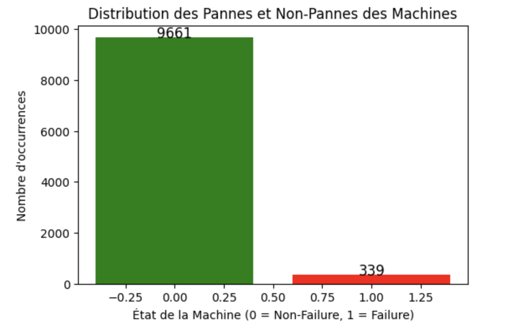

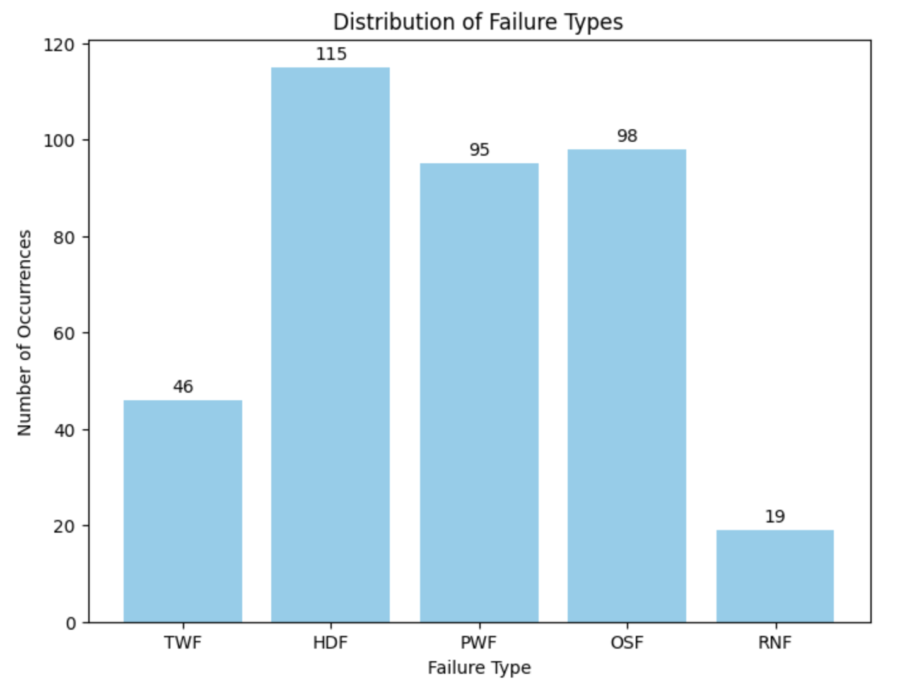

#### Problèmes Identifiés

La première observation est qu'une classe est largement majoritaire par rapport à l'autre. Cela implique qu'entraîner un modèle sur une base de données comme celle-ci aura tendance à biaiser les résultats. Le modèle risque de ne pas être performant dans ses prédictions. 

Deuxièmement, les types d'erreurs sont aussi très inégaux. Ainsi, entraîner un modèle sur ce type de base de données pourrait conduire le modèle à identifier uniquement un type d'erreur. 

Enfin, nous avions aussi un problème de **multi-labeling**. En effet, il pouvait y avoir plusieurs erreurs pour une seule et même machine. Étant donné que ces cas étaient minoritaires, nous avons préféré les supprimer afin d'éviter les problèmes liés au **multi-labeling**.

#### Entraînement du Modèle

En partant de ces observations, nous avons quand même essayé d'entraîner et de tester un modèle.

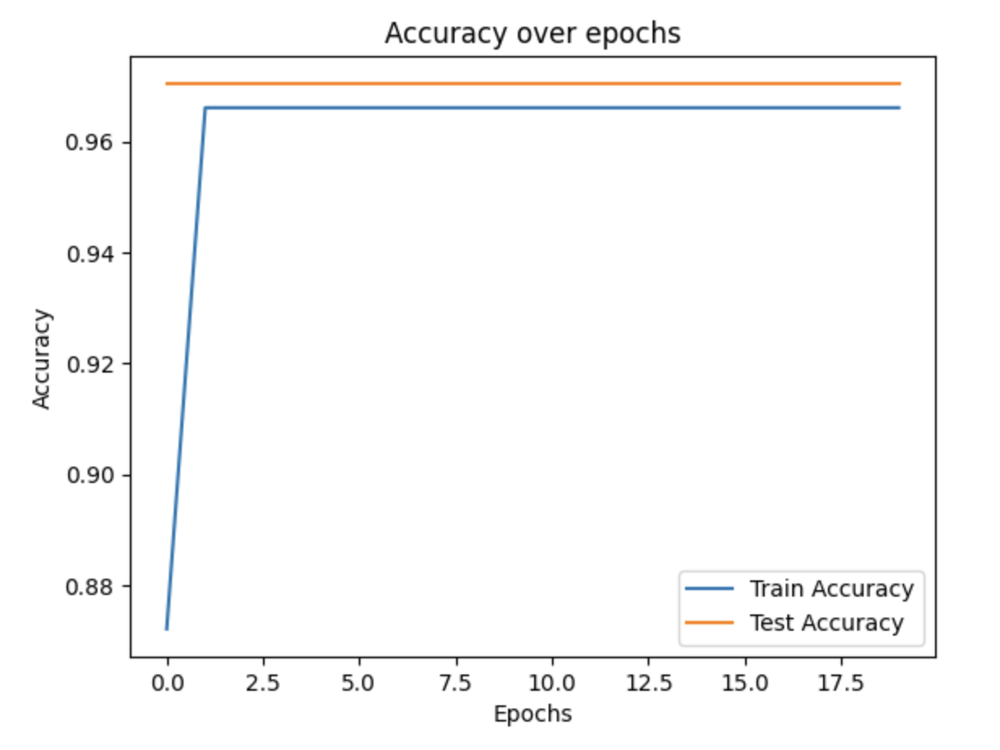
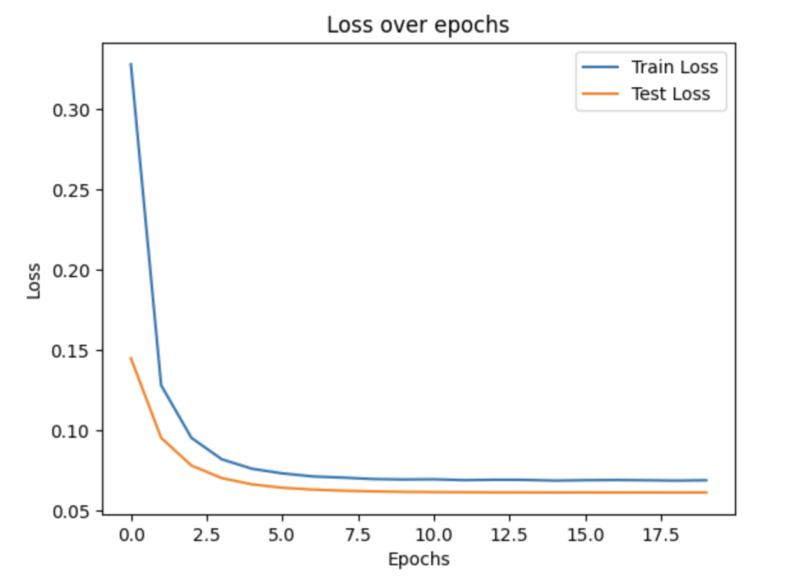

D'après ces résultats, notre modèle semble tout bonnement parfait et ne présente aucune faille. Cependant, pour en être sûrs, nous avons étudié les matrices de confusion liées à chaque classe.


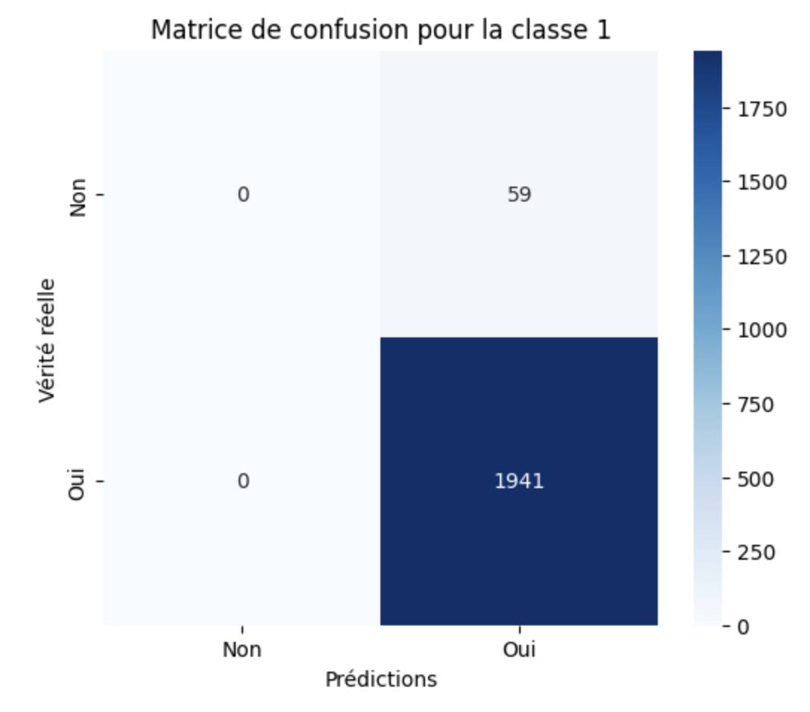
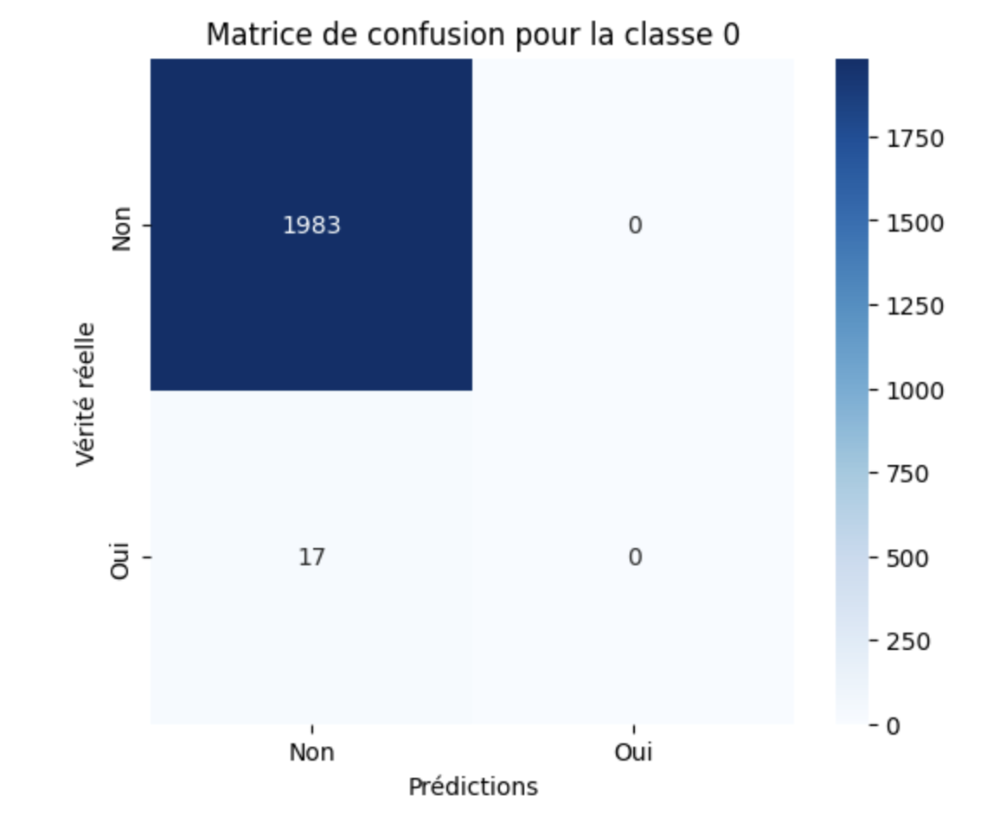

Nous avons alors remarqué que notre modèle prédit que toutes les machines vont soit dans la classe "oui", soit dans la classe "non", sans aucune nuance entre les deux. Cela signifie qu'il ne prédit pas vraiment, ou pas du tout. Le modèle a mal été entraîné et considère simplement que toutes les machines fonctionnent sans erreur, ou qu'elles ont toutes une erreur.

#### Solutions Appliquées au Déséquilibre des Classes

Pour pallier ce problème de déséquilibre des classes dans notre base d'entraînement, nous avons essayé deux méthodes afin d'équilibrer les classes.

1. **SMOTE (Synthetic Minority Over-sampling Technique)** : Cette méthode permet de créer artificiellement des cas pour les classes minoritaires.
2. **Undersampling** : Cette méthode consiste à réduire la taille des classes majoritaires.

Ensuite, nous avons retesté notre modèle et avons obtenu des résultats bien différents.

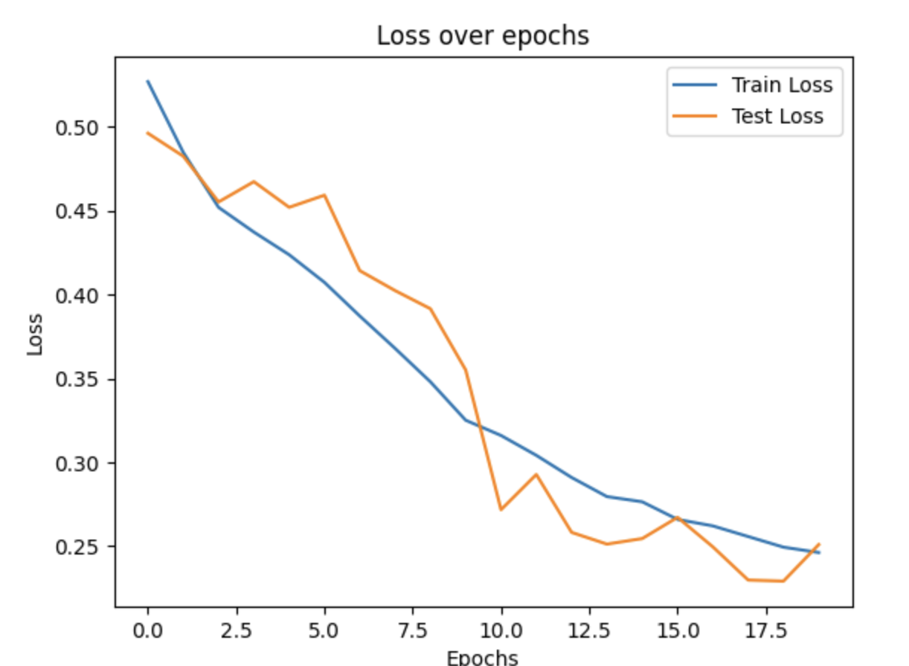
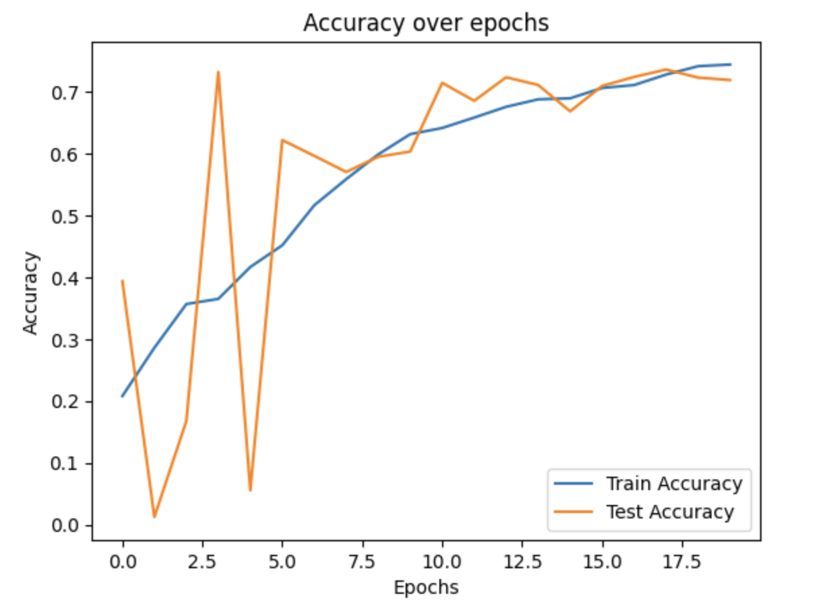

Notre modèle obtient maintenant une accuracy bien moins parfaite qu'auparavant, avec notamment un peu d'overfitting. Pour vérifier la pertinence de notre équilibrage de classes, nous avons également visionné les matrices de confusion des classes, comme tout à l'heure.

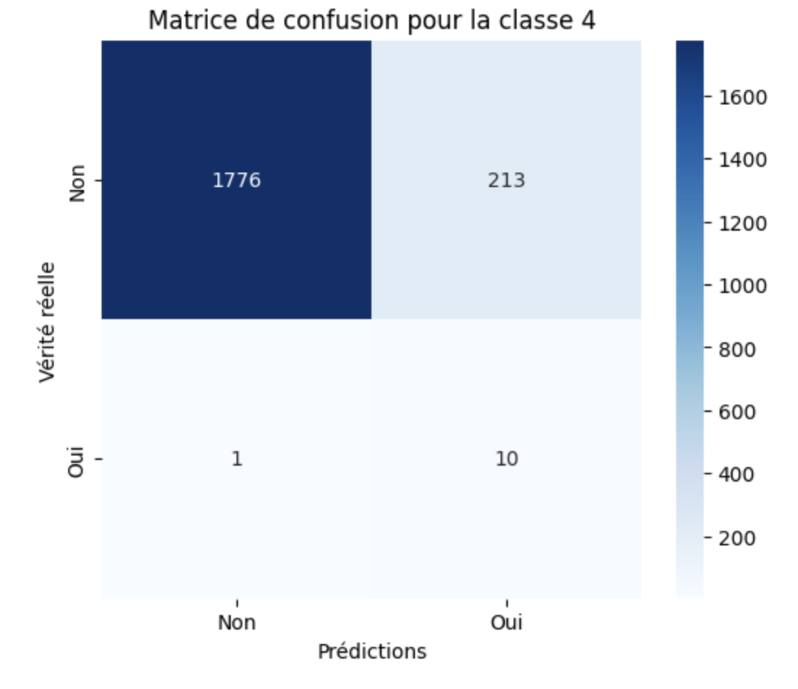
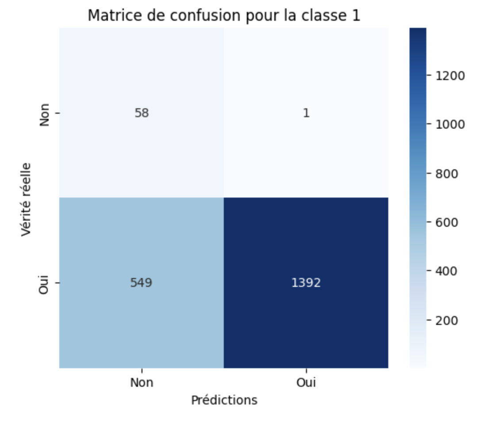

#### Conclusion

Le résultat n'est toujours pas satisfaisant à 100%, mais notre modèle permet déjà de prédire un peu plus efficacement. En effet, il ne met plus toutes les machines dans la même catégorie. Il commence à essayer de les répartir de manière plus nuancée, même si cela ne correspond pas toujours parfaitement à la réalité. Le modèle commence réellement à faire des prédictions.

Finalement, nous avons conservé ce modèle afin de tester la suite sur la carte, même s'il n'est clairement pas optimisé et qu'il mériterait encore quelques améliorations.

## 3. Implémentation sous Cube IDE

Afin de mettre notre modèle sur CubeIDE, nous avons dû importer notre fichier `.h5` ainsi que nos données de test d'input et d'output. Ensuite, nous avons simplement envoyé le code sur la carte.

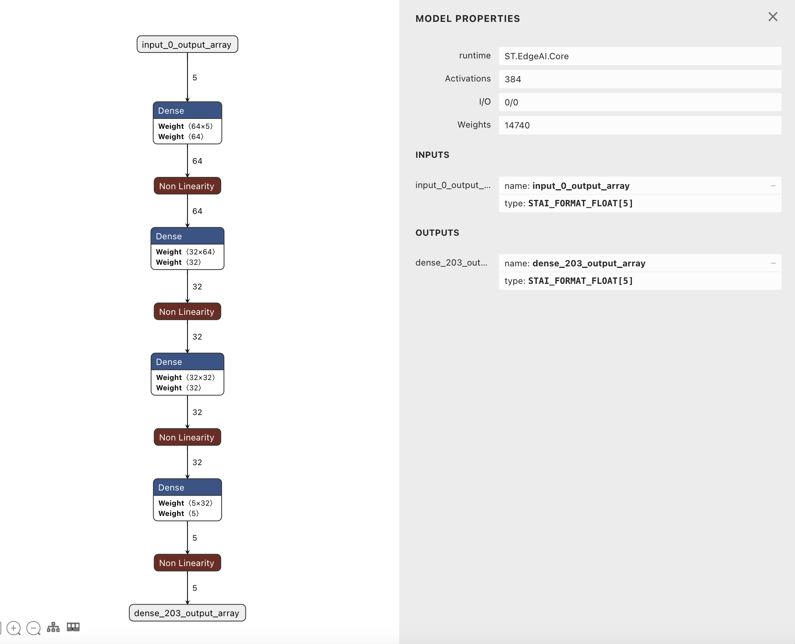

Le kit 32L4R9IDISCOVERY est une plateforme de démonstration et de développement complète pour le microcontrôleur STM32L4R9AI basé sur le cœur Arm® Cortex®-M4 de STMicroelectronics. Il met en avant les caractéristiques ultra-basse consommation et possède 640 Ko de RAM embarquée, ce qui correspond parfaitement à notre utilisation qui est un système de prédiction sur un système embarqué.

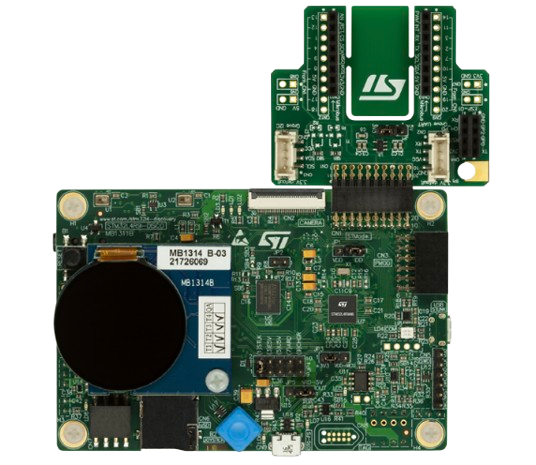

## 4. **Connexion UART**

La connexion via UARTs'effectue à l'aide d'un script python appelé comm.py. Ce script permet la communication entre la carte et le pc mais surtout permet de lancer l'évaluation du modèle qui a été envoyé dans la carte.

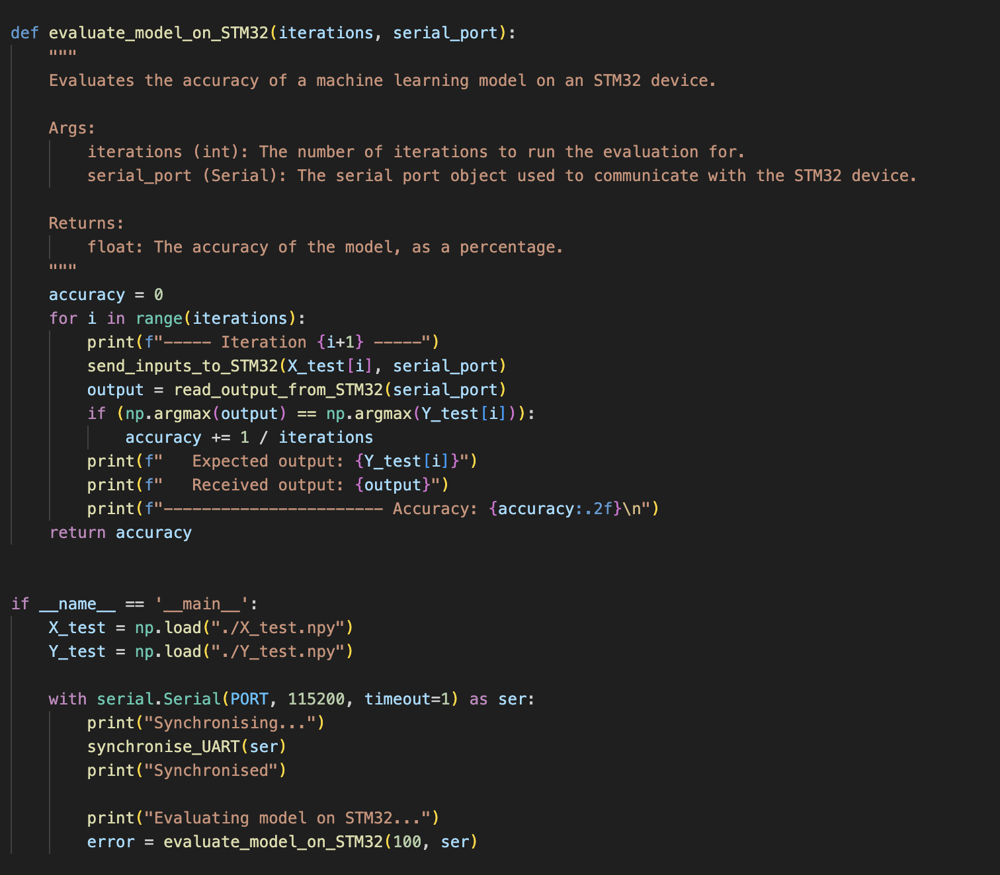


## 5. **Analyse des resultats**

Une fois le code mis sur la carte on obtient cela comme résultat en paramétrant 100 itérations sur notre modèle : 

### Début des itérations

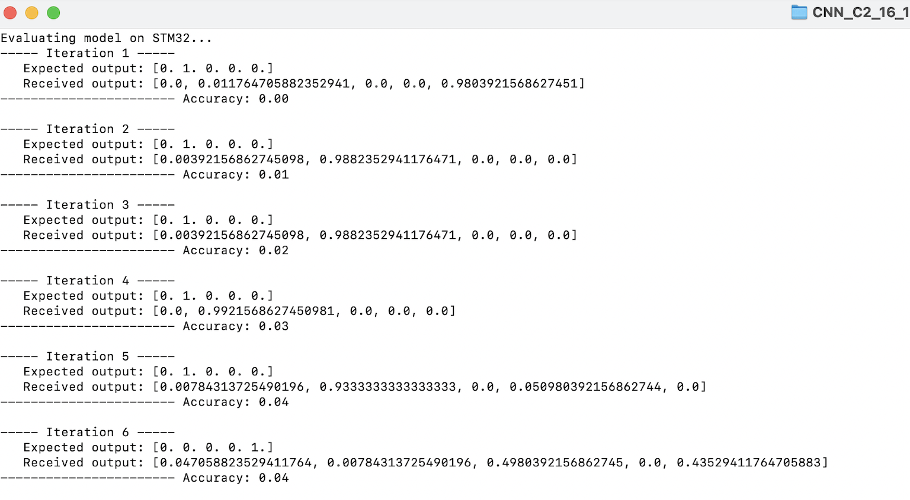

### Fin des itérations

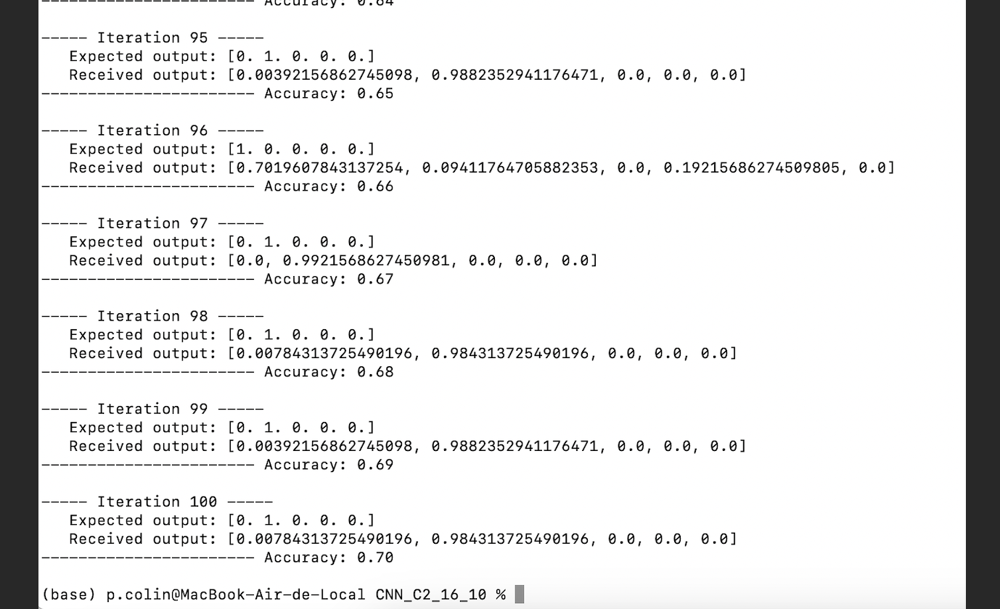

Pour notre accuraccy on obtient 70% à la fin comparé à notre valeur théorique sur google collab de 71% c'est tout à faire cohérent. On a donc un modèle de prédiction plutôt performant certes perfectible mais qui fonctionne sur une carte. On a pris un réseau de neurones peu conséquent avec un nombre de paramètres qui restent très raisonnable afin de garder une consommation d'énergie relativement faible, du moins, du mieux que l'on peut.

Les pistes d'améliorations seront de réduire l'overfitting de notre modèle comme on a pu le constater sur le google collab en théorie. Nous pouvons aussi améliorer notre accuracy car même si 70% c'est plutôt élevée, c'est largement améliorable. De plus, l'équilibre des classes dans notre base de données pourrait aussi être revu afin de l'optimiser et ainsi éviter que certaines classes soient moins bien évaluées par notre modèle.
